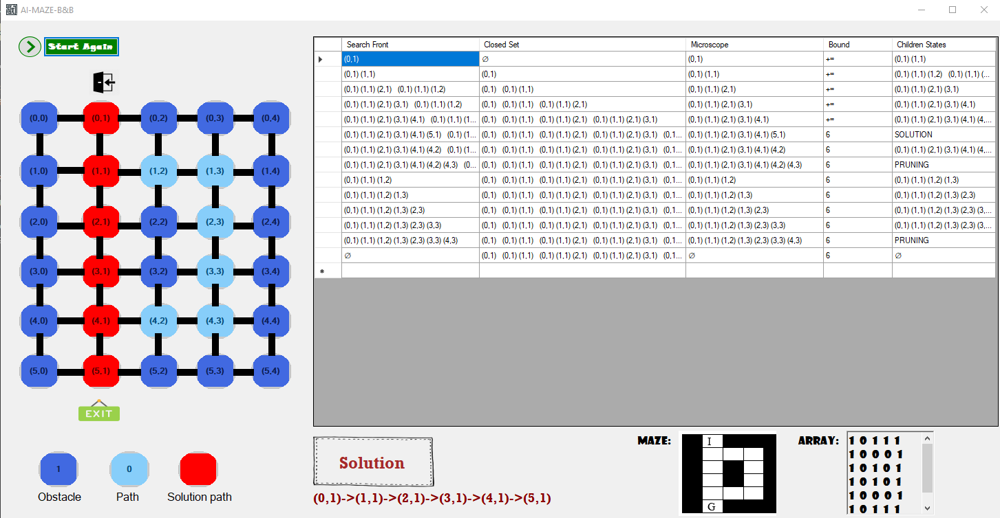

This is project that implements branch and bound algorithm using C# and Visual Studio for this specific maze:

There is a user interface to run the algorithm with a button that works as the "loop" for each step.

