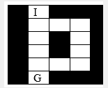

This is a Visual Studio project that implements branch and bound algorithm using C# for this specific maze:

where

I: is the entrance of the maze
G: is the exit of the maze

There is a user interface to run the algorithm with a button that works as the "loop" for each step.

